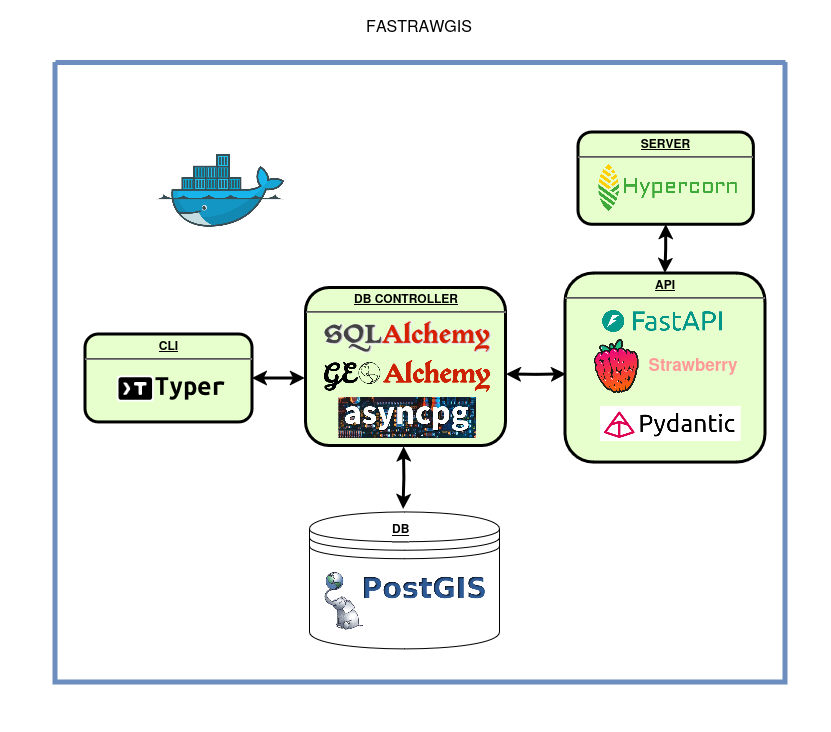

# ***FastrawGIS***

[](https://github.com/python/cpython/)

[](https://github.com/fastapi/fastapi/)

[](https://github.com/strawberry-graphql/strawberry/)

[](https://github.com/encode/starlette/)

[](https://github.com/agronholm/anyio/)

[](https://github.com/pydantic/pydantic/)

[](https://github.com/pydantic/pydantic-settings/)

[](https://github.com/postgis/postgis/)

[](https://github.com/sqlalchemy/sqlalchemy/)

[](https://github.com/geoalchemy/geoalchemy2/)

[](https://github.com/MagicStack/asyncpg/)

[](https://github.com/fastapi/typer/)

[](https://github.com/pallets/click/)

[](https://github.com/Textualize/rich/)

[](https://github.com/pgjones/hypercorn/)

[](https://github.com/MagicStack/uvloop/)

[](https://github.com/docker-library/python/)


-   [Motivation](#motivation)
-   [Description](#description)
-   [Features](#features)
-   [Requirements](#requirements)
-   [Setup](#setup)
-   [Usage](#usage)
-   [GraphQL Schema](#graphql-schema)
-   [Diagram](#diagram)

## Motivation

This repository is intended to serve as a working example of an API that
combines several tools and topics. Basically, **FastrawGIS** supports
asynchronous handling of HTTP requests with GraphQL syntax, converting
them into database queries and returning the proper results.

## Description

The main purpose of the app is to design and model events, locations,
and timetables so that the underlying spatial database allows queries regarding
distance and time factors.

## Features

- Simple setup.
- Fast response.
- Validation of requests.
- Type hinted code, divided in different layers.
- Easily extendable with more models, fields, and filters.
- Search by space, supporting geographic coordinates and radius with meters accuracy.
- Search by time, supporting schedules with minutes accuracy.

## Requirements

- Docker Compose.
- Some GraphQL client, like for example [Bruno](https://github.com/usebruno/bruno/).

## Setup

```bash
docker compose up
```

Host's port 80 should be available. Otherwise, it can be customized at `docker-compose.yml`.

The following two commands create and load the database.

```bash
docker exec -it fastrawgis-app python app/cli/database/main.py create
docker exec -it fastrawgis-app python app/cli/database/main.py load
```

## Usage

We can leverage real sample data and perform `POST` requests to `http://localhost/graphql`,
obtaining two items with each of the following queries.

Search by space.

```graphql
{
  events (
    day: "25-07-12",
    lat: 41.39491039820101,
    lon: 2.1755553553648936,
    radius: 2500,
  ) {
    id
    venue {
      id
      town {
        id
        name
      }
      name
      point {
        lat
        lon
      }
      address
      distance
    }
    name
    start
    end
    desc
  }
}
```

Search by time.

```graphql
{
  events (
    day: "25-07-12",
    startTime: "8:00",
    endTime: "12:00",
  ) {
    id
    venue {
      id
      town {
        id
        name
      }
      name
      point {
        lat
        lon
      }
      address
    }
    name
    start
    end
    desc
  }
}
```
## GraphQL Schema

If you change the GraphQL schema at `schema.py` and want to check
the corresponding `schema.gql`, it can be generated this way.

```bash
docker exec -it fastrawgis-app strawberry export-schema app.api.schema:schema > app/api/schema.gql
```

## Diagram

The diagram shows the interaction between the main components of the application.

